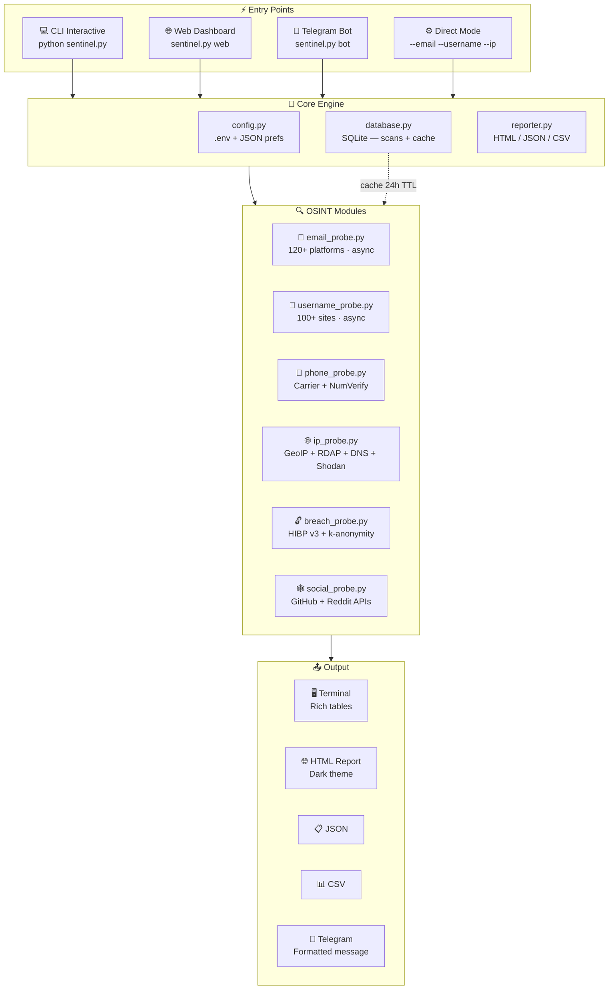
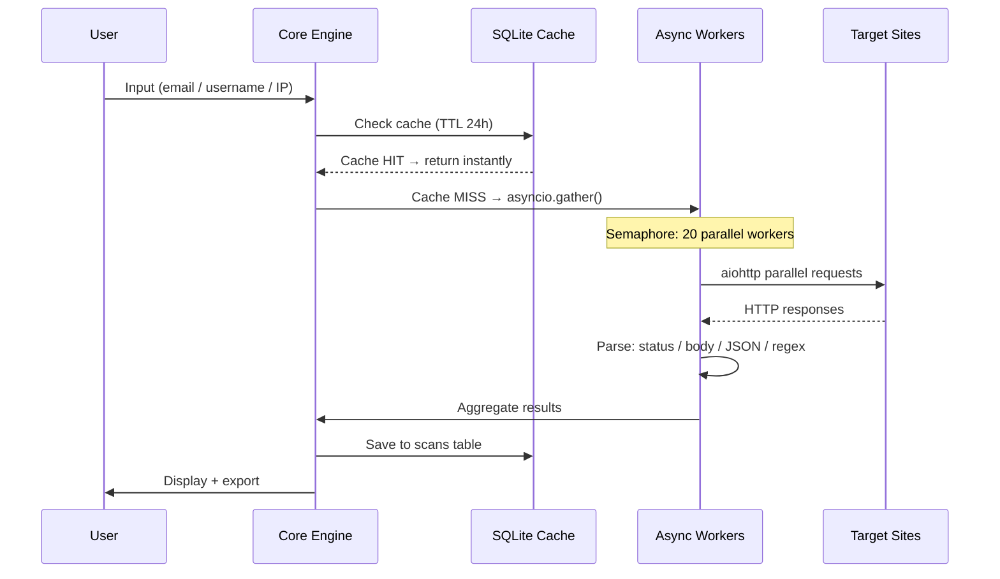

### OSINT INTELLIGENCE FRAMEWORK

**Email · Username · Phone · IP/Domain · Breach · Social**

---

[](https://python.org)
[](LICENSE)
[]()
[]()
[]()
[]()
[]()

</div>

---

## 📋 Overview

**SENTINEL OSINT** is a professional-grade open-source intelligence framework built for security researchers and OSINT analysts. Given an email address, username, phone number, IP, or domain — it probes hundreds of platforms, APIs, and data sources in parallel to build a comprehensive intelligence profile.

> ⚡ Built from scratch in Python · Runs on Android (Termux) · By **Feri**

---

## ✨ Feature Highlights

| # | Module | Description | Coverage |
|---|--------|-------------|----------|
| 📧 | **Email Intelligence** | Check email across registered accounts | 120+ platforms |
| 👤 | **Username OSINT** | Track username footprint | 100+ sites |
| 📱 | **Phone Intelligence** | Carrier, country, line type detection | NumVerify + heuristics |
| 🌐 | **IP / Domain OSINT** | GeoIP, WHOIS, DNS, Shodan, Threat Intel | 5 free APIs |
| 🔓 | **Breach Inspector** | Data breach + paste exposure check | HaveIBeenPwned v3 |
| 🕸️ | **Social Profiler** | Profile aggregation from public APIs | GitHub, Reddit + more |
| 📊 | **Report Engine** | Export to HTML / JSON / CSV | 3 formats |
| 🤖 | **Telegram Bot** | Full bot interface via commands | /email /username /ip /breach |
| 🌐 | **Web Dashboard** | Flask-based local REST dashboard | localhost:5000 |

---

## 🗂️ Project Structure

```
sentinel-osint/
│
├── sentinel.py                 ← Main entry point (CLI + argparse)
├── install.sh                  ← One-step installer (Termux/Linux/macOS)
├── requirements.txt
├── .env.example                ← API key template
├── README.md
│
├── core/
│   ├── banner.py               ← pyfiglet ASCII banner + "by Feri"
│   ├── config.py               ← .env + JSON config manager
│   ├── database.py             ← SQLite — scans table + cache (TTL 24h)
│   ├── reporter.py             ← HTML / JSON / CSV export engine
│   └── utils.py                ← validators, helpers, category colors
│
├── modules/
│   ├── email_probe.py          ← Async email checker — 120+ site definitions
│   ├── username_probe.py       ← Async username checker — 100+ sites
│   ├── phone_probe.py          ← Phone intel + carrier detection
│   ├── ip_probe.py             ← GeoIP + RDAP + DNS + Shodan free
│   ├── breach_probe.py         ← HIBP v3 + k-anonymity password check
│   └── social_probe.py         ← Social profile aggregator
│
├── data/
│   ├── email_services.json     ← 120+ email platform definitions
│   ├── username_sites.json     ← 100+ username site definitions
│   └── sentinel.db             ← SQLite database (auto-created on first run)
│
├── web/
│   └── app.py                  ← Flask REST web dashboard
│
├── bot/
│   └── telegram_bot.py         ← Telegram bot (async polling)
│
├── reports/                    ← Auto-generated reports (HTML/JSON/CSV)
└── diagram.html                ← Architecture diagram (open in browser)
```

---

## 🏗️ Architecture



---

## 🔄 Scan Data Flow



---

## 🚀 Quick Start

### Termux (Android)

```bash
# 1. Clone
git clone https://github.com/yourusername/sentinel-osint.git
cd sentinel-osint

# 2. Install (one command)
bash install.sh

# 3. Configure API keys (optional but recommended)
nano .env

# 4. Run
python sentinel.py
```

### Linux / macOS

```bash
git clone https://github.com/yourusername/sentinel-osint.git
cd sentinel-osint && bash install.sh && python sentinel.py
```

---

## 🖥️ Usage

```bash
# ── Interactive CLI (recommended) ─────────────────────────────
python sentinel.py

# ── Web dashboard ─────────────────────────────────────────────
python sentinel.py web
# Open http://127.0.0.1:5000

# ── Telegram bot ──────────────────────────────────────────────
python sentinel.py bot

# ── Direct scan (non-interactive) ─────────────────────────────
python sentinel.py --email    target@example.com
python sentinel.py --username johndoe
python sentinel.py --ip       8.8.8.8
python sentinel.py --ip       example.com
python sentinel.py --phone    +628123456789

# ── With output format ────────────────────────────────────────
python sentinel.py --email target@example.com --output html
python sentinel.py --email target@example.com --output json
python sentinel.py --email target@example.com --output csv

# ── Version / help ────────────────────────────────────────────
python sentinel.py --version
python sentinel.py --help
```

### Telegram Bot Commands

```
/email   target@example.com   → Email intelligence scan
/username johndoe             → Username footprint
/ip      8.8.8.8              → IP / domain OSINT
/breach  target@example.com   → Breach exposure check
/help                         → Show all commands
```

---

## 📊 Sample Output

```
╭──────────────────────────────────────────────────────────────────────╮
│  📧 EMAIL INTELLIGENCE REPORT                                        │
│  Target: target@gmail.com  ·  Found: 47  ·  Checked: 120  ·  8.2s   │
╰──────────────────────────────────────────────────────────────────────╯

  Platform           Category     URL                           Status
  ──────────────────────────────────────────────────────────────────────
  Binance            finance      https://binance.com           ✅ FOUND
  Chess.com          gaming       https://chess.com             ✅ FOUND
  Coinbase           finance      https://coinbase.com          ✅ FOUND
  Discord            social       https://discord.com           ✅ FOUND
  GitHub             tech         https://github.com            ✅ FOUND
  Google             tech         https://google.com            ✅ FOUND
  Instagram          social       https://instagram.com         ✅ FOUND
  LinkedIn           social       https://linkedin.com          ✅ FOUND
  Netflix            streaming    https://netflix.com           ✅ FOUND
  Spotify            streaming    https://spotify.com           ✅ FOUND
  Steam              gaming       https://steampowered.com      ✅ FOUND
  Tokopedia          shopping     https://tokopedia.com         ✅ FOUND
  Twitter/X          social       https://twitter.com           ✅ FOUND
  ...and 34 more
```

---

## ⚙️ API Keys (Optional)

The tool works **without any API keys**, but adding them unlocks full functionality:

| Service | Purpose | Link | Free Tier |
|---------|---------|------|-----------|
| **HaveIBeenPwned** | Breach checking | [Get key](https://haveibeenpwned.com/API/Key) | Paid ($3.50/mo) |
| **IPInfo** | Geolocation + org | [Get token](https://ipinfo.io/account/token) | 50k req/month |
| **NumVerify** | Phone validation | [Get key](https://numverify.com/product) | 100 req/month |
| **Shodan** | Port/vuln data | [Get key](https://account.shodan.io) | Free (internetdb) |

Edit `.env`:
```env
HIBP_API_KEY=your_key_here
IPINFO_TOKEN=your_token_here
NUMVERIFY_KEY=your_key_here
TELEGRAM_BOT_TOKEN=your_bot_token
```

---

## 🔧 Platform Coverage

<details>
<summary><strong>📧 Email Sites (120+) — click to expand</strong></summary>

| Category | Platforms |
|----------|-----------|
| **Social** | Twitter/X, Instagram, Facebook, LinkedIn, TikTok, Snapchat, Discord, Pinterest, Tumblr, Reddit, Telegram, Weibo, LINE, Viber, Mastodon, Flickr, DeviantArt, Behance, Dribbble, Medium, Imgur, Wattpad, Quora |
| **Tech/Dev** | GitHub, GitLab, Google, Microsoft, Apple, Adobe, Dropbox, Zoom, Slack, Notion, Figma, Canva, Mailchimp, HubSpot, WordPress, DigitalOcean, Heroku, Replit, CodePen, Hashnode, Dev.to, ProtonMail, Zoho, Tutanota |
| **Finance** | PayPal, eBay, Venmo, Cash App, Coinbase, Binance, Kraken, Shopify, Etsy, Amazon |
| **Gaming** | Steam, Epic Games, Blizzard, EA/Origin, Roblox, Chess.com, Lichess |
| **Dating** | Tinder, Bumble, OkCupid, Badoo, Hinge |
| **Streaming** | Spotify, Netflix, Twitch, TikTok, Disney+, Hulu, Max (HBO), Prime Video, Crunchyroll, SoundCloud, Mixcloud, Bandcamp, Last.fm, Vimeo, Dailymotion |
| **Shopping** | Amazon, eBay, Shopify, Etsy, AliExpress, Lazada, Tokopedia, Bukalapak, Shopee |
| **Regional (SEA)** | Tokopedia, Bukalapak, Shopee, Gojek, Grab, LINE |

</details>

<details>
<summary><strong>👤 Username Sites (100+) — click to expand</strong></summary>

| Category | Platforms |
|----------|-----------|
| **Social** | Twitter, Instagram, Reddit, Pinterest, Tumblr, Snapchat, Telegram, Discord, Flickr, DeviantArt, Behance, Dribbble, Medium, Quora, Mastodon, Wattpad, Flipboard, About.me, Patreon, Substack |
| **Tech** | GitHub, GitLab, Bitbucket, Stack Overflow, Replit, CodePen, Dev.to, Hashnode, LeetCode, HackerRank, Codeforces, npm, PyPI, Gravatar, WordPress, AngelList, Keybase, Linktree, Carrd |
| **Gaming** | Steam, Epic Games, Roblox, Chess.com, Lichess, itch.io, Speedrun.com |
| **Streaming** | Twitch, YouTube, Spotify, SoundCloud, Bandcamp, Last.fm, Mixcloud, Vimeo, Dailymotion, Trakt |
| **Regional** | Tokopedia, Bukalapak, Bilibili, Weibo |
| **Other** | Duolingo, Strava, IMDb, Goodreads, Letterboxd, MyAnimeList, AniList, Ko-fi, BuyMeACoffee |

</details>

---

## 🛡️ Requirements

```txt
python >= 3.9
aiohttp >= 3.9.0
requests >= 2.31.0
rich >= 13.7.0
questionary >= 2.0.1
pyfiglet >= 1.0.2
flask >= 3.0.0
python-telegram-bot >= 20.7
python-dotenv >= 1.0.0
```

---

## ⚠️ Legal Disclaimer

This tool is intended **strictly for authorized security research, OSINT investigations, and educational purposes only**.

- ✅ Authorized penetration testing
- ✅ Security research on your own accounts
- ✅ OSINT analysis with proper authorization
- ❌ Unauthorized access to third-party accounts
- ❌ Stalking, harassment, or malicious intent

Users are solely responsible for ensuring compliance with applicable local laws and platform terms of service. The developer assumes **no liability** for any misuse.

---

## 📄 License

```
MIT License — Copyright (c) 2024 Feri

Permission is hereby granted, free of charge, to any person obtaining a copy
of this software and associated documentation files (the "Software"), to deal
in the Software without restriction, including without limitation the rights
to use, copy, modify, merge, publish, distribute, sublicense, and/or sell
copies of the Software.
```

---

<div align="center">

**Built with ⚡ by [Feri](https://github.com/yourusername)**

*Python Developer · Termux · OSINT · Automation*

`SENTINEL OSINT v2.0.0` — *Intelligence. Precision. Speed.*

</div>
